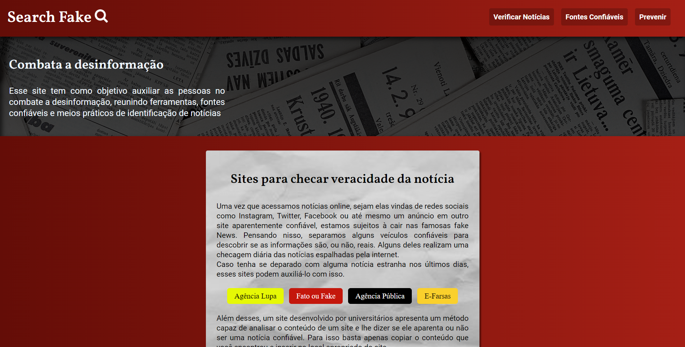

# Projeto: Search Fake



## Descrição do Projeto
<p> Projeto desenvolvido para a disciplina de Projeto Integrador do Curso de Sistemas de Informação como uma página informativa reunindo conteúdo sobre prevenção contra fake news. </p>

## 🚀 Tecnologias utilizadas
- ``HTML``
- ``CSS``

## :memo: Licença

Esse projeto está sob a licença MIT.

## 🔗 Link para o site

```
https://rubensgabriel.github.io/fake-news/
```
